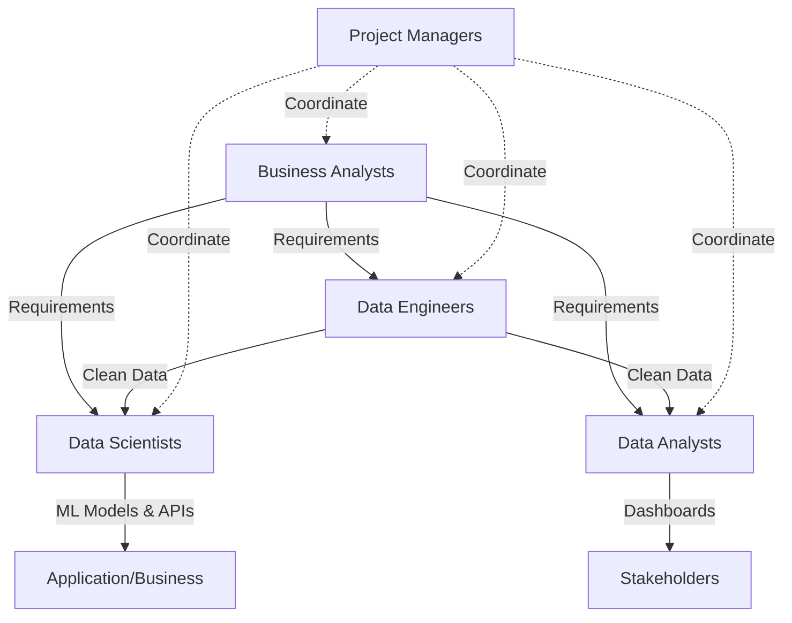

# Customer Intelligence Platform

**A sophisticated, cross-functional analytics and machine learning environment designed to drive deeper insights and foster data-driven decision-making.**

## Project Overview

### Business Problem
*   **Current State:** 15% monthly churn, $2M annual revenue loss.
*   **Goal:** Build a data-driven platform to predict churn, personalize recommendations, and optimize inventory.
*   **Outcome:** Reduce churn to 10%, increase revenue, improve efficiency.

For the full execution plan, see [Project Overview & Execution Guide](documentation/project_execution_guide.md).

## Workflow & Collaboration

For a detailed step-by-step guide on branching and PRs, see the [Repository Collaboration Guide](documentation/repository_collaboration.md).

## Repository Structure
- `data_engineering/` → pipelines, dbt, ETL
- `data_science/` → ML models, notebooks, APIs
- `data_analytics/` → dashboards, SQL models
- `documentation/` → architecture, dictionaries, guides

See [Team Responsibilities](documentation/team_responsibilities.md) for detailed role descriptions.

## Branch Workflow
`feature/*` → `team/*` → `dev` → `main`

Please review [CONTRIBUTING.md](CONTRIBUTING.md) for development guidelines.
